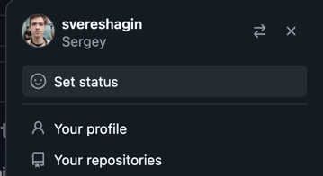
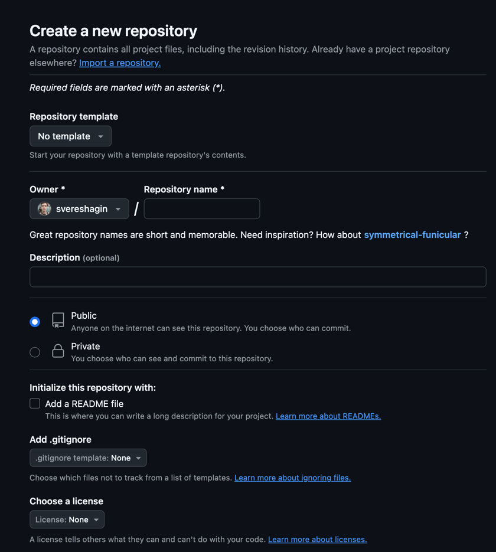
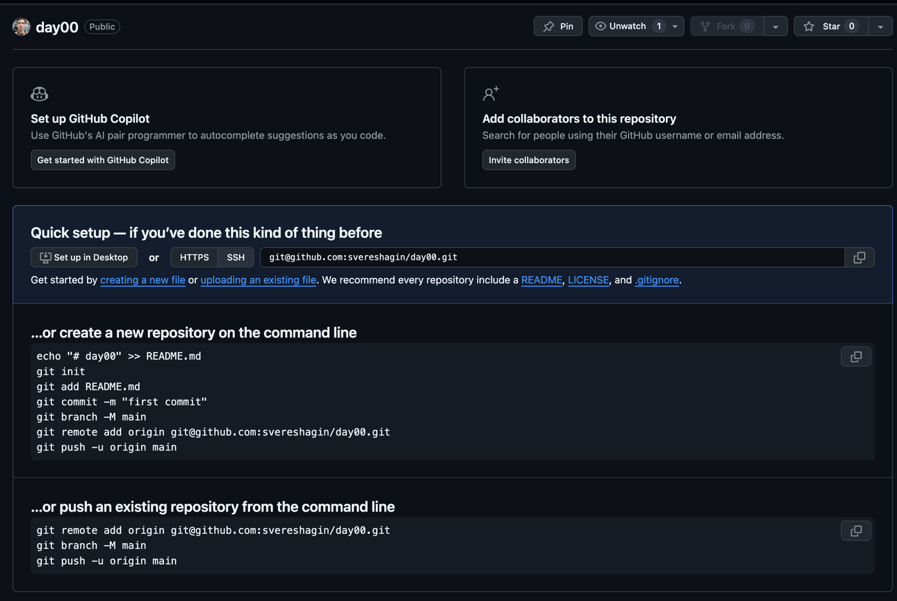
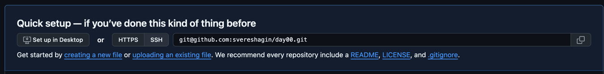
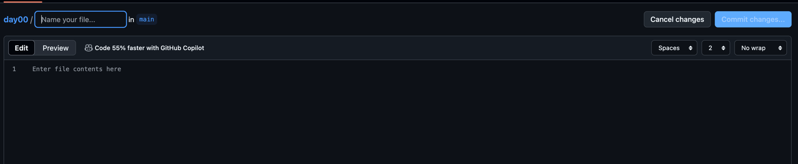
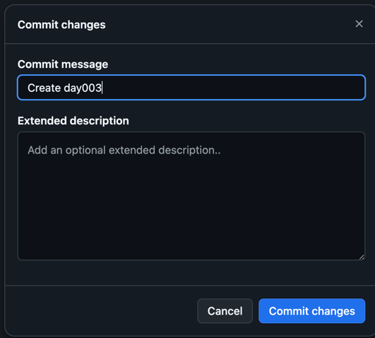
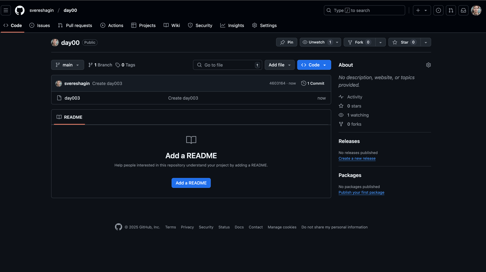

Работа с GITHUB

1. Если у вас ещё нет GitHub репозитория, то зарегестрируйтесь (SignUP), если есть, то войдите (SignIN)
2. В правом верхнем углу нажмите на картинку своего профиля 
3. нажмите на Your repositories 
4. Далее жмёте на New(выделено синим цветом) 
5. Находите поле Repository name  и заполняете, где Public ничего не меняете
репозиторий должен быть публичным. Где Initialize this repository with: Add a README file, ставим галку для создания файла
6.  на этой страничке находите  creating a new file, жмёте.
7.  Заполняете имя файла, можете оставить файл сейчас пустым. Имя любое.
Жмёте commit changes.
8. 
9.  Жмёте commit changes.
10.  Репозиторий готов.
11. Здесь же вы создаёте новые файлы через 
12. Принципы создания файлов:
1.1 в названии файла на конце должен быть суффикс .sql как my_model.sql
1.2 в файле должен быть скрипт(ответ на задание) например SELECT * FROM person
13. Только после выполнения всех заданий вы отправляете ссылку на ваш проект мне в личные сообщения в телеграмм или на почту(спросите на паре)