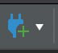
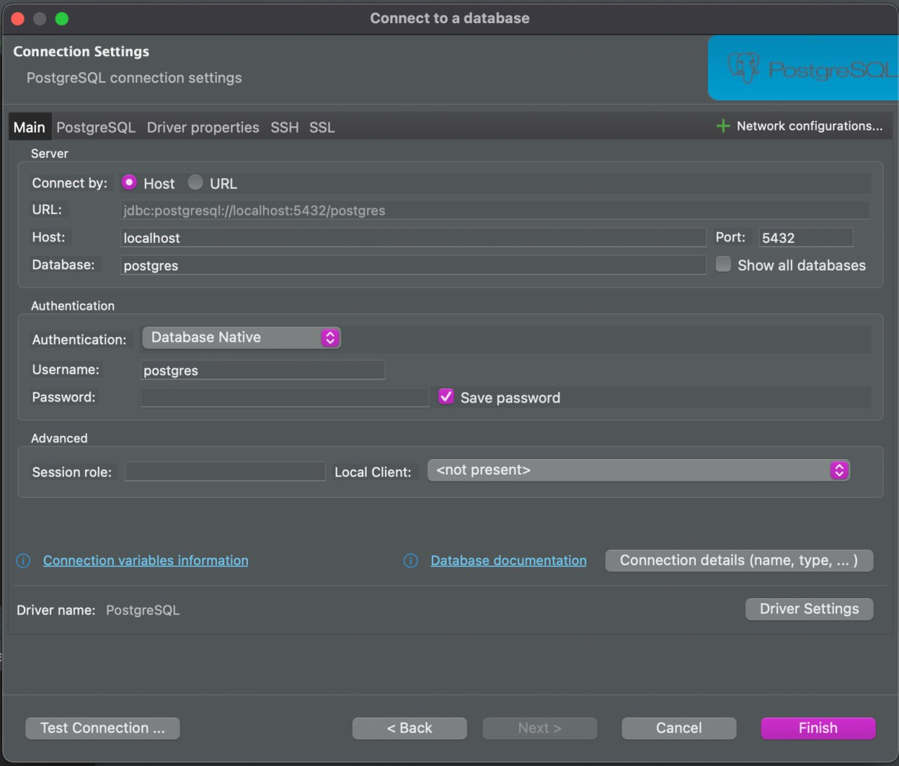
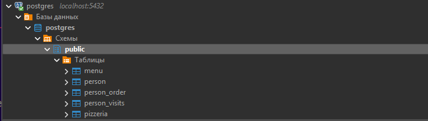
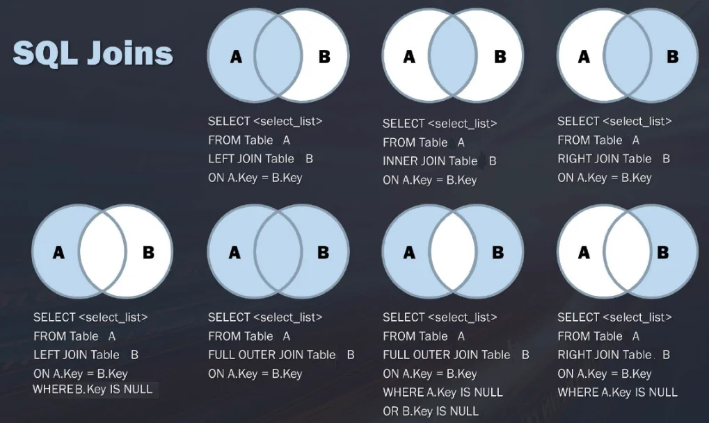
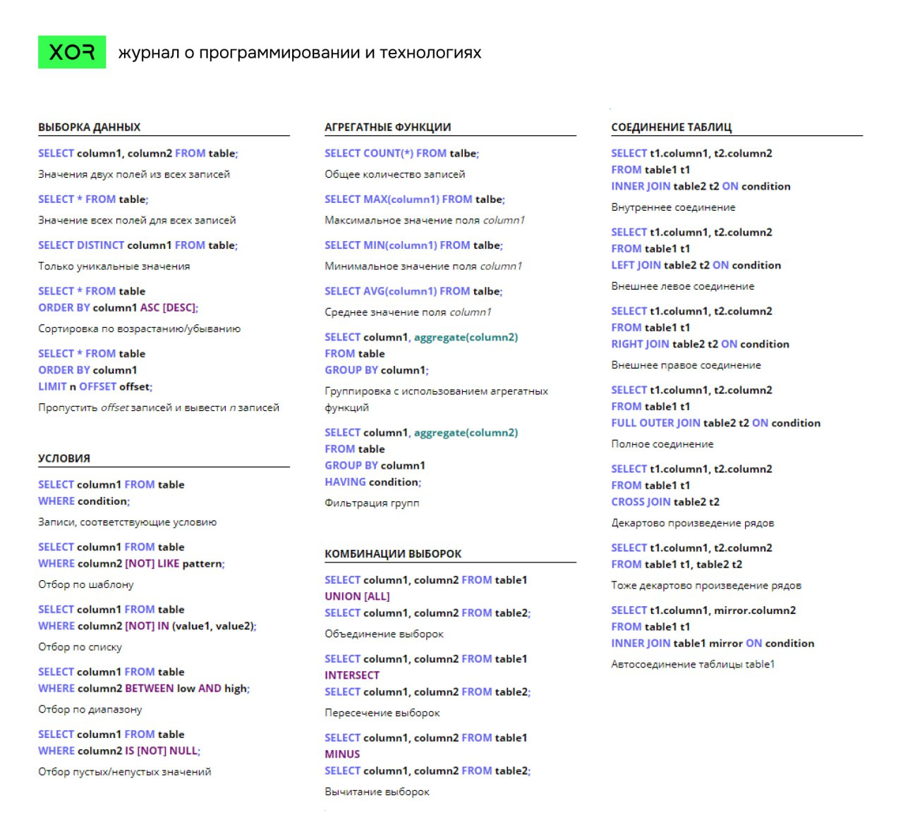

# TODO доправить со скринами
# TODO улучшить структуру 
## ContentBoard
- [Структура проекта](#contentboard)
- [Предисловие](#работа-с-базами-данных-sql)
- [Проекты](#проекты)
- [Подготовка к работе](#подготовка-к-работе-)
    - [Инструкция Windows](#инструкция-windows)
    - [Инструкция Linux](#) в разработке
    - [Инструкция Mac](#)   в разработке
- [GitHub/Cдача работ](#github-)
- [Краткий справочник по SQL](#язык-sql-справочник)
- [Полезные ссылки](materials)
---


# **Работа с базами данных (SQL)**

# **Как работать над проектами(ЧИТАТЬ ВНАЧАЛЕ)**
1. Внимательно прочитайте данный файл, только после того как прочитали можно приступать к выполнению заданий
2. Подготовьте свой компьютер к выполнению заданий([Перейти](#инструкция-windows))
3. Не пользуйтесь нейронными сетями/ИИ помощниками/ChatGPT для жульничества(аннулирование баллов за проект).
Для знакомства с SQL можете использовать выборку ссылок на ресурсы ниже, прочитать официальную документацию или попросить
помощи у преподавателя/других студентов.
4. Выполненные задания закиньте на отдельный GitHub репозиторий и отправьте ссылку мне([GitHub](#github-))


Желаю вам удачи и приятного времени 😊.


## **Проекты**

# Проекты по уровням
| **Уровень** | **Проект**                            | **Статус**      | **Дополнительные Проекты** |
|-------------|---------------------------------------|-----------------|----------------------------|
| **Junior**  |                                       | ученический лвл |                            |
| project1    | [первый проект](./junior/Start)       | NoExp yet       |                            |
| project2    | [второй проект](./junior/ST1)         | NoExp yet       |                            |
| project3    | [третий проект](./junior/ST2)         | NoExp yet       |                            |
| project4    | [четвёртый проект](./junior/End)      | NoExp yet       |                            |
|             |                                       |                 |                            |
| **Middle**  | `SQL_senior` [RetailAnalytics v1.0]() | In progress     |                            |
| project1    | `DOOM` [RetailAnalytics v1.0]()       |                 | In progress                |
| project2    | `SQL_senior` [RetailAnalytics v1.0]() | In progress     |                            |
| project3    | `DOOM` [RetailAnalytics v1.0]()       |                 | In progress                |
| project4    | `SQL_senior` [RetailAnalytics v1.0]() | In progress     |                            |
|             | `DOOM` [RetailAnalytics v1.0]()       |                 | In progress                |
| **Senior**  | `SQL_senior` [RetailAnalytics v1.0]() | In progress     |                            |
| project1    | `DOOM` [RetailAnalytics v1.0]()       |                 | In progress                |
| project2    | `SQL_senior` [RetailAnalytics v1.0]() | In progress     |                            |
| project3    | `DOOM` [RetailAnalytics v1.0]()       |                 | In progress                |
| project4    | `SQL_senior` [RetailAnalytics v1.0]() | In progress     |                            |
|             | `DOOM` [RetailAnalytics v1.0]()       |                 | In progress                |
## Общее количество проектов по уровням

- **Junior**: 4 проекта
- **Middle**: 4 проекта
- **Senior**: 4 проекта

## Примечания
Для допуска к экзамену обязательно выполнение 4 проектов.

## Подготовка к работе 

## Инструкция Windows
1. Открыть DBeaver
2. Найти connect to a database
скорее всего выглядит так

3. далее подключаетесь к БД, для этого выбираете PostgreSQL 

4. вводите данные и идёте заниматься с cmd скриптом

Далее
1. Зайти в проводник
2. Двигайтесь по пути: C:\Program Files\PostgreSQL\16\bin
3. shift+правая кнопка мыши на пустом пространстве в проводнике, открыть PowerShell
4. набрать команду ./psql -U postgres
5. ввести пароль:   password
далее вписываете password(то что вы вводите не будет показываться в целях безопасности, но всё нормально, всё вводится)
6. далее вставляем скрипт из текущего проекта(Если вы находитесь на 1 проекте то для вас соответственно он находится в
junior/Start/materials/model.sql т.е в пути меняется только название проекта) вы открываете файл и скопированный текст вставляете в psql консоль
7. нажимаете enter
8. Следуйте в DBaver, нажмите правой кнопкой на postgres, нажмите обновить. 
9. Если видите следующее в DBeaver то, всё готово
Изучите работу со скриптами и переходите к выполнению заданий начиная от Start.
чтобы подключиться к бд через DBeaver:
правой кнопкой по postgres, свойства, вписываем пароль password
QUERY:
     Открытие Query Консоли: редактор sql - открыть sql скрипт - новый скрипт либо F3 и тоже новый скрипт.


## GitHub 
[CCЫЛКА](./GITHUB/README.md) гайд по работе с репозиторием
1. Зайдите на свой GitHub
2. Создайте репозиторий
3. В репозиториях есть директории типа ex00, ex01... в них вы помещеаете ответы на тесты в файлики типа data01.sql , где data01 - название файла и .sql формат файла.
4. далее все файлы или если вы умеете, то репозитории, запушиваете на гит или мануально перекидываете по файлику.
5. Ссылку на гит репорзиторий скидываете в лс/группу группы в соц.сети.

## **Язык SQL справочник**

`SQL (Structured Query Language)` - это язык программирования, используемый для работы с реляционными базами данных. Он предоставляет набор команд и инструкций для создания, изменения, управления и извлечения данных из базы данных.

SQL позволяет выполнять различные операции с данными, такие как создание таблиц, добавление, обновление и удаление записей, выполнение запросов для выборки данных иногое другое. Он широко применяется в различных областях, связанных с хранением иправлением данными, включая веб-разработку, анализ данных, бизнес-интеллект другие.

### **Примеры некоторых распространенных операторов SQL:**
```SQL
SELECT --(для выборки данных)
INSERT --(для добавления новых записей)
UPDATE --(для обновления существующих записей)
DELETE --(для удаления записей)
```
### **Часто используемые базы данных:**
- MySQL
- PostgreSQL
- Oracle
- MS SQL Server 
- SQLite
- dBase
- Hadoop
- MaxDB
- MariaDB
- Openbase

## **Общая структура баз данных**

`База данных` - это организованная коллекция структурированных данных, которая позволяет эффективно хранить,правлять и извлекать информацию. Она представляетобой систему, в которой данные организованы в таблицы или другие структуры, связанные между собой по определенным правилам. Базы данных используются дляранения информации в различных областях, таких как бизнес, наука, государственноеправление и другие. Они позволяют эффективно обрабатывать большие объемы данных, обеспечивать целостность и безопасность информации, а также выполнять запросы и анализировать данные для получения нужной информации.

## **Создание БД, таблиц и работа с ними**

### **Создание и удаление БД**
Чтобы создать базу данных, существует следущий SQL-запрос:
```SQL
CREATE DATABASE <db_name>;
```
Для удлание базы данных, уже используется следущий SQL-запрос:
```SQL
DROP DATABASE <db_name>;
```

Наиболее используемые типа данных для таблиц в базе данных:
- INT (числа)
- VARCHAR (строки до 255 символов)
- TEXT (большой текст)
- DATE (даты)

### **Создание таблицы**
```SQL
CREATE TABLE <table_name>(
    id INT NOT NULL AUTO_INCREMENT,
    name VARCHAR(30),
    bio TEXT,
    birth DATE/DATETIME,
    PRIMARY KEY(id)
);
```
>` NOT NULL` (не может быть пустым)

> `AUTO_INCREMENT` (каждая строка поля будет увеличиваться на один)

> `PRIMARY KEY(id)` (указанное поле не может повторяться)

> `VARCHAR(30)` - указывает максимальный размер строки

### **Удаление таблицы**
```SQL
DROP TABLE <table_name>;
```
### **Добавление поля в уже созданную таблицу**
```SQL
ALTER TABLE <table_name> ADD <var_name> VARCHAR/INT/...;
```

### **Удаление поля в уже созданной таблице**
```SQL
ALTER TABLE <table_name> DROP COLUMN <var_name>;
```

## **Добавление и обновление записей в БД**

### **Добавление записи **

```SQL
INSERT INTO <table_name> (<var_name>, ...) VALUES ('val', ...), (),..
```

### **Изменение поля**

```SQL
ALTER TABLE <table_name> CHANGE <var_name> <new_var_name> INT/... NOT NULL;
```

### **Обновление данных**

```SQL
UPDATE  `<table_name>` SET `<var_name>` = 'name' WHERE id = 1 AND age = 44;
```

## **Удаление данных из БД**

Для удаление данных из БД используется несколько операторов: Delete, Truncate и Alter. Последний для удаления колонок, а остальные для удаление записей, а также очистки таблицы от всего.

### **Команда Delete**

Команда Delete используется для удаление записей из таблицы. В команде можно указать параметр Where, чтобы удалить лишь те элементы, которые подходят под условие.

```SQL
-- Удаление всех записей из таблицы
DELETE FROM <var_name>;

-- Удаление лишь некоторых
DELETE FROM  WHERE id > 5;
```

### **Команда Truncate**

Команда Truncate используется для очистки таблицы от всех записей.

```SQL
TRUNCATE <var_name>;
```

Разница команд `Delete` и `Truncate` в том, что после Delete данные еще можно восстановить, а после Truncate нельзя. Из этого вытекает, что удаление данных черех Truncate происходит быстрее.

## **Выборка данных из БД. WHERE, ORDER, LIMIT.**

### Команда SELECT

```SQL
-- Выбор всех записей
SELECT * FROM <table_name>;

-- Выбор всех записей, но лишь некоторые поля
SELECT <var_name>, <var_name> FROM <table_name>;

-- Выбор лишь некоторых записей
SELECT * FROM <table_name> WHERE id > 6 AND id < 8;
```

### **Выборка по параметру**

```SQL
SELECT * FROM <table_name> WHERE <var_name> = 'val';

SELECT * FROM <table_name> WHERE <var_name> = 'val' AND id > 2;
```

### **Сортировка**

```SQL
SELECT * FROM <table_name> ORDER BY id;

-- Сортировка по убыванию
SELECT * FROM <table_name> ORDER BY id DESC;

-- Сортировка вместе с оператором Where
SELECT * FROM <table_name> WHERE id > 9 ORDER BY id DESC;
```

### **Лимит по выбору**

```SQL
-- Вывод лишь одной записи
SELECT * FROM <table_name> ORDER BY id LIMIT 1;

-- Вывод 5 последних записей
SELECT * FROM <table_name> ORDER BY id LIMIT 5;

-- Пропуск первых 7 записей и вывод последующих 8
SELECT * FROM <table_name> ORDER BY id DESC LIMIT 7, 8;
```

## **Создание индексов и работа с ними**

Создание и применение индекса к полю ускоряет поиск данных в этом поле. Рекомендуется избегать создания индексов для каждого поля, чтобы не негативно сказывалось на оптимизации базы данных.

### **Создание индекса**

```SQL
CREATE INDEX <index_name>
ON <table_name> (<var_name>);
```

### **Ключ Foreign**

`Foreign Key (внешний ключ)` - это столбец или набор столбцов в таблице базы данных, который устанавливает связь между двумя таблицами. Он определяет отношение между двумя таблицами, где значения в столбце с внешним ключом соответствуют значениям в столбце первичного ключа другой таблицы.

Внешний ключ используется для обеспечения целостности данных поддержания связей между таблицами. Он обеспечивает ссылочную целостность, что означает, что значения в столбце с внешним ключом должны быть либо равны значениям в столбце первичного ключа другой таблицы, либо быть NULL (если разрешено).

Пример использования внешнего ключа: предположим, у нас есть таблицы "Заказы" иКлиенты". В таблице "Заказы" мы можем иметь столбец "ID клиента", который является внешним ключом, связывающим каждый заказ с конкретным клиентом из таблицы "Клиенты Это позволяетам легко получать информацию о клиенте, связанную с каждым заказом.

Использование внешних ключей помогает обеспечить целостность данных, предотвращает ошибки и обеспечивает связи между таблицами базе данных.

### **Пример использования FOREIGN KEY**

```SQL
CREATE TABLE Orders (
 id int NOT NULL,
 OrderNumber int NOT NULL,
 PersonID int,
 PRIMARY KEY (OrderID),
 FOREIGN KEY (PersonID) REFERENCES users(id)
);
```

## **Объединение данных. JOIN (INNER, LEFT, RIGHT)**

В SQL, оператор JOIN используется для объединения данных из двух или более таблиц на основе определенного условия.н позволяет комбинировать строки из разных таблиц в один результат запроса.

JOIN выполняет соединение строк из таблиц на основе совпадения значений в указанных столбцах. Существуют различные типы JOIN, включая:

- `INNER JOIN` (внутреннее соединение): Возвращает только те строки, которые имеютовпадающие значения в обоих таблицах.

- `LEFT JOIN` (левое соединение):озвращает все строки из левой таблицы и соответствующие строки из правой таблицы. Если нет совпадающих значений, то для правой таблицы будут возвращены NULL значения.

- `RIGHT JOIN` (правое соединение): Возвращает все строки из правой таблицы и соответствующие строки из левой таблицы. Если нет совпадающих значений, то для левой таблицы будут возвращены NULL значения.

- `FULL JOIN` (полное соединение): Возвращает все строки из обеих таблиц,опоставляя их по совпадающим значениям. Если нет совпадающих значений, то дляедостающих значений будут возвращены NULL значения.



`JOIN-условие` определяется с помощью ключевого слова ON, где указывается условие сравнения столбцов для объединения таблиц.

### Пример использования оператора JOIN:
```SQL
SELECT *
FROM Table1
INNER JOIN Table2 ON Table1.column = Table2.column;
```
В этом примере выполняется внутреннее соединение между Table1 и Table2 на основе совпадения значений в столбцах column. Результатом будет набор строк, содержащих данные из обеих таблиц,де значения столбца column совпадают.

Чаще всего используется формат Inner Join.
```SQL
SELECT Orders.ID, Customers.Name, Orders.OrderDate, Orders.Total
FROM Orders
INNER JOIN Customers ON Orders.CustomerID = Customers.ID;
```

## **Псевдонимы, функции и Group By**

Псевдонимы (AS) используются для указания нового имени для поля или таблицы.

```SQL
SELECT biNameField AS bf FROM table;

SELECT o.personID AS id FROM ordersUsersTable AS o;
```

### **Основные функции для быстрой работы с данными:**

- count - подсчет элементов;
- min (max) - минимальный и максимальный элемент в определенном поле;
- avg - среднее арифметическое;
- sum - сумма всех элементов;
- ucase - всё в верхний регистр;
- lcase - всё в нижний регистр;

```SQL
SELECT MIN(price) AS 'Минимальная цена' FROM table;
```

### **Группирование данных**

```SQL
SELECT MIN(price) AS 'Минимальная цена', price AS 'Цена' FROM table GROUP BY price;
```

## **Все основные операции**


